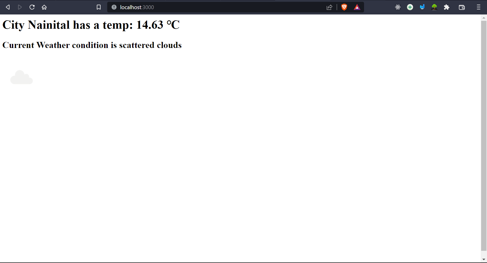

# Weather App

This is a weather app project that allows you to retrieve weather forecasts for any city using the OpenWeatherMap API.

## How to Use

1. Clone the repository to your local machine.
2. Install the required dependencies by running `npm install` in the project directory.
3. Obtain an API key from OpenWeatherMap by creating an account on their website.
4. Open the `app.js` file and replace the `apiKey` variable with your actual API key.
5. Start the server by running `node app.js` in the project directory.
6. Open your browser and navigate to `http://localhost:3000`.
7. Enter the name of the city you want to get the weather forecast for and click the "Generate!" button.
8. The server will fetch the weather data from the API and display the temperature, weather description, and an icon representing the weather condition.

Extra tip:
if you are only using code install these 3 depencdencies:
- `express`
- `body-parser`
- `nodemon` (you won't need to continuously start the server)

## Technologies Used

- Express.js: A web application framework used to build the server-side of the application.
- HTML/CSS: Used to create the user interface and style the page.
- JavaScript: Used to handle form submission, make API requests, and update the page dynamically.
- OpenWeatherMap API: Used to retrieve weather data based on the user's input.

## File Structure

- `index.html`: The HTML file containing the user interface for the weather app.
- `app.js`: The server-side JavaScript file responsible for handling requests, making API calls, and serving the HTML file.
- `style.css`: The CSS file containing the styles for the weather app. `[INTERNAL]`

## Weather App Screenshot

## License

This project is licensed under the [MIT License](LICENSE).
